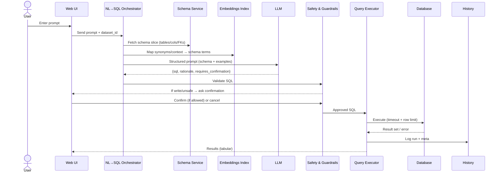

# NL→SQL Data Exploration Assistant — ARCHITECTURE.md

> **Goal:** Let users explore relational data with natural language, safely and quickly, via a **Web UI** (primary) and optional CLI (Linux terminal). The system converts prompts to SQL, validates against the schema, safely executes queries, and returns clear tabular results with history, exports, and optional explanations.

---

## 1) Problem & Objectives

**Problem/Need**

* Speed up data exploration—no waiting for DB admins/analysts to write queries.
* Let users interact with data in the way they think (natural language), not strict SQL.
* Explore relationships and trends without building dashboards or hand-written queries.
* Reuse the same interface across multiple Dell products/datasets.

**Primary Objectives**

* Convert prompts → SQL using an LLM, grounded in the database schema.
* Validate and **safeguard** SQL before execution (read-only by default).
* Execute against a provided database file (e.g., `.db`) or build one from raw data.
* Return results as friendly tables; allow **export to CSV/JSON**.
* Maintain **history** of prompts, generated SQL, and results.
* Provide **tooltips/examples** and optional **SQL preview/edit**.
* **Web UI** as the main interface; optional Linux terminal CLI.

**Secondary/Nice-to-haves**

* Live auto-suggestions as the user types.
* Explain the SQL in plain language.
* Chat-style follow-ups (e.g., “Now sort them by date”).

**Non-Goals**

* Full BI replacement (dashboards/visual builders may come later).
* Arbitrary untrusted write access without explicit confirmation and guardrails.

---

## 2) High-Level Architecture

```mermaid
flowchart LR
  subgraph UI[User Interfaces]
    WEB[Web UI (Primary)]
    TUI[CLI / TUI (Linux Terminal, optional)]
  end

  subgraph API[Orchestrator API]
    NLQ[NL→SQL Orchestrator]
    SG[Schema Service]
    SAFE[Safety & Guardrails]
    QE[Query Executor]
    HX[History & Export]
  end

  subgraph LLM[LLM Services]
    PROMPT[Prompt Builder / Few-shot]
    OPENAI[(OpenAI API)]
    EMB[Embeddings Index]
  end

  subgraph DATA[Data & Files]
    DB[(User .db file)]
    ING[Ingestion / DB Builder]
    CACHE[(Schema Cache)]
    LOGS[(Query Runs / History)]
  end

  WEB -->|prompt| NLQ
  TUI -->|prompt| NLQ
  NLQ --> SG
  NLQ --> PROMPT --> OPENAI
  OPENAI --> NLQ
  NLQ --> SAFE
  SAFE -->|approved SQL| QE
  QE --> DB
  SG <--> CACHE
  QE -->|results| HX
  HX -->|download| WEB
  HX -->|download| TUI
  ING --> DB
  SG --> ING
  NLQ --> EMB
  EMB --> NLQ
```

**Key Ideas**

* **Schema-aware prompting**: We construct the LLM prompt using *only* relevant tables/columns (RAG over schema + synonyms) to reduce hallucinations.
* **Guardrails**: Block dangerous SQL by default (DDL/DML) unless the user explicitly confirms. Enforce timeouts, row limits, and parameterization.
* **Isolation**: Execute SQL in a sandboxed process with read-only mode by default.

---

## 3) Component Responsibilities

### 3.1 Web UI (Primary)

* Browser-based application providing:

  * Prompt input box with tooltips/examples.
  * **Result table** rendering; paging for large results.
  * SQL preview/edit before execution.
  * Export results to CSV/JSON.
  * File upload for `.db` or ingestion from CSV/JSON.
  * Maintain history with searchable log.
  * Optional chat-style follow-up queries.

### 3.2 CLI / TUI (Linux Terminal, Optional)

* Lightweight terminal client providing:

  * Prompt input and history navigation.
  * Table rendering in text.
  * File selection for `.db`.
  * Export to CSV/JSON.
* Useful for developers or scripting.

### 3.3 Orchestrator API

* Stateless HTTP service (or embedded module in CLI) coordinating:

  1. **Schema Service**: Introspects database (tables, columns, FKs), caches structure, builds a glossary of synonyms.
  2. **NL→SQL Orchestrator**: Builds LLM prompt with schema slices, examples, and user history; parses model output (JSON schema) to get `sql`, `action`, `rationale`.
  3. **Safety & Guardrails**: Static and dynamic checks (parser-based allow/deny lists); user confirmation for write operations; LIMIT enforcement.
  4. **Query Executor**: Runs SQL against the selected dataset in a sandbox with timeouts and row caps; streams rows.
  5. **History & Export**: Stores runs; allows CSV/JSON export.

### 3.4 LLM Services

* **Prompt Builder**: Few-shot examples and task instructions; inserts schema excerpts.
* **OpenAI API**: Text generation for SQL; optional **function-calling / JSON mode** to return structured fields: `{ sql, rationale, requires_confirmation, notes }`.
* **Embeddings Index**: Index of table/column names + sample values to map synonyms (e.g., “clients” → `customers`).

### 3.5 Data & Files

* **User .db**: Primary query target (e.g., SQLite or DuckDB file). Users can also ingest CSV/JSON to create a `.db`.
* **Schema Cache**: Snapshot of database structure + FK relationships (JSON) with refresh TTL.
* **Query Runs / History**: Prompts, SQL, status, timing, row counts, errors, rationale.

---

## 4) Data Flow

### 4.1 Prompt → SQL → Results (Happy Path)



### 4.2 Build DB from Given Data

```mermaid
sequenceDiagram
  actor U as User
  participant WEB as Web UI
  participant ING as Ingestion
  participant DB as SQLite/DuckDB
  participant SG as Schema Service

  U->>WEB: Upload CSV/JSON/Parquet files or table spec
  WEB->>ING: Start ingestion
  ING->>DB: Create DB/tables; load data
  ING-->>WEB: Ingestion summary
  WEB->>SG: Introspect & cache schema
  SG-->>WEB: Schema available for NL→SQL
```

---

## 5) Database Schema (Internal Metadata)

> The **user database** structure varies (e.g., `Customers`, `Orders`, `Products`). We maintain a **separate internal metadata store** to track datasets, cache schema, and log query runs. This can live in a lightweight SQLite file alongside the app.

**Tables (internal):**

* `datasets`

  * `id` (pk)
  * `name`
  * `path` (filesystem path to `.db`)
  * `engine` (`sqlite` | `duckdb` | `postgres` optional)
  * `status` (`ready` | `indexing` | `error`)
  * `created_at`, `updated_at`

* `schema_cache`

  * `dataset_id` (fk → datasets)
  * `tables_json` (JSON list of tables with columns, types)
  * `fks_json` (JSON list of foreign keys)
  * `sample_values_json` (optional samples per column)
  * `updated_at`

* `synonyms`

  * `dataset_id`
  * `term` (e.g., "clients")
  * `entity_type` (`table` | `column`)
  * `mapped_to` (canonical name)
  * `weight` (float)
  * `source` (`manual` | `embedding` | \`auto
